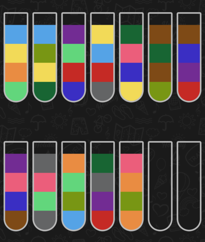
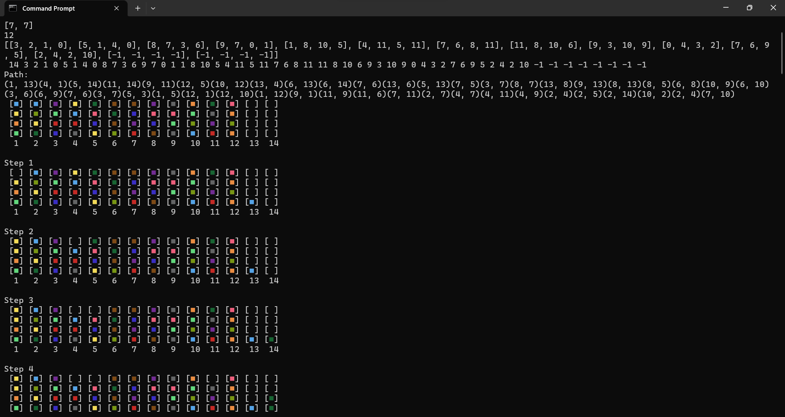
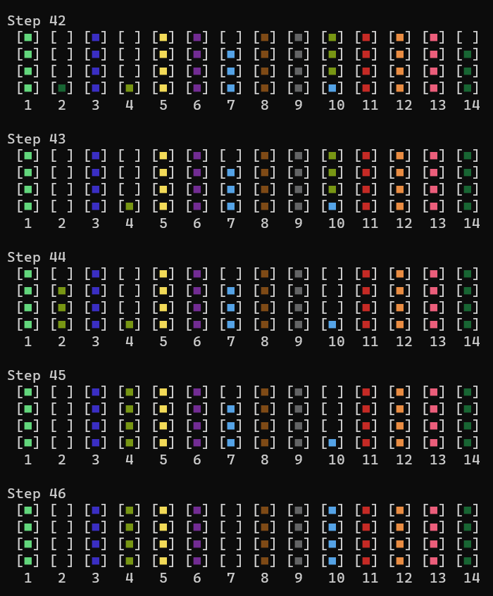

<h1>Water Sort Puzzle Solver</h1>

The solver uses DFS algorithm in C++ to solve the puzzle.

Passing a long vector of bottles and colors is a boring task so I wrote a python code to convert screenshoot of bottles to vector using OpenCV and passing it to the compiled program.

The python code gets an image like the following one:

Then it finds number of bottles and number of colors; then passes vector of bottles into solver program.

Finally it shows steps to solve the puzzle in a beautiful way

O

O

O

**Bugs**

This project is too old and there are some bugs in both solver part and image processing part.

The DFS algorithm sometimes fails to find the answer and stucks in loop (There are some screenshots of failed examples)

The image processing part is noise-sensetive and it is not working on any image.